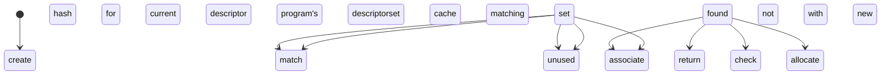

## Performance 2.0

In my last post, I left off with an overall 25%ish improvement in framerate for my test case:

[]({{site.url}}/assets/bench1/endpost1.png)

At the end, this was an extra 3 fps over my previous test, but how did I get to this point?

The answer lies in even more unnecessary queue submission. Let's take a look at zink's `pipe_context::set_framebuffer_state` hook, which is called by gallium any time the framebuffer state changes:
```c
static void
zink_set_framebuffer_state(struct pipe_context *pctx,
                           const struct pipe_framebuffer_state *state)
{
   struct zink_context *ctx = zink_context(pctx);
   struct zink_screen *screen = zink_screen(pctx->screen);

   util_copy_framebuffer_state(&ctx->fb_state, state);

   struct zink_framebuffer *fb = get_framebuffer(ctx);

   zink_framebuffer_reference(screen, &ctx->framebuffer, fb);
   if (ctx->gfx_pipeline_state.render_pass != fb->rp)
      ctx->gfx_pipeline_state.hash = 0;
   zink_render_pass_reference(screen, &ctx->gfx_pipeline_state.render_pass, fb->rp);

   uint8_t rast_samples = util_framebuffer_get_num_samples(state);
   /* in vulkan, gl_SampleMask needs to be explicitly ignored for sampleCount == 1 */
   if ((ctx->gfx_pipeline_state.rast_samples > 1) != (rast_samples > 1))
      ctx->dirty_shader_stages |= 1 << PIPE_SHADER_FRAGMENT;
   if (ctx->gfx_pipeline_state.rast_samples != rast_samples)
      ctx->gfx_pipeline_state.hash = 0;
   ctx->gfx_pipeline_state.rast_samples = rast_samples;
   if (ctx->gfx_pipeline_state.num_attachments != state->nr_cbufs)
      ctx->gfx_pipeline_state.hash = 0;
   ctx->gfx_pipeline_state.num_attachments = state->nr_cbufs;

   /* need to start a new renderpass */
   if (zink_curr_batch(ctx)->rp)
      flush_batch(ctx);
   struct zink_batch *batch = zink_batch_no_rp(ctx);
   zink_framebuffer_reference(screen, &batch->fb, fb);

   framebuffer_state_buffer_barriers_setup(ctx, &ctx->fb_state, zink_curr_batch(ctx));
}
```
Briefly, zink copies the framebuffer state, there's a number of conditions under which a new pipeline object is needed, which all result in `ctx->gfx_pipeline_state.hash = 0;`. Other than this, there's sample count check for [sample changes]({{site.url}}/aNIRtomy) so that the shader can be modified if necessary, and then there's the setup for creating the Vulkan framebuffer object as well as the renderpass object in `get_framebuffer()`.

Eagle-eyed readers will immediately spot the problem here, which is, aside from the fact that there's not actually any reason to be setting up the framebuffer or renderpass here, how zink is also flushing the current batch if a renderpass is active.

The change I made here was to remove everything related to Vulkan from here, and move it to `zink_begin_render_pass()`, which is the function that the driver uses to begin a renderpass for a given batch.

This is clearly a much larger change than just removing the `flush_batch()` call, which might be what's expected now that ending a renderpass no longer forces queue submission. Indeed, why haven't I just ended the current renderpass and kept using the same batch?

The reason for this is that zink is designed in such a way that a given batch, at the time of calling `vkCmdBeginRenderPass`, is expected to either have no `struct zink_render_pass` associated with it (the batch has not performed a draw yet) or have the same object which matches the pipeline state (the batch is continuing to draw using the same renderpass). Adjusting this to be compatible with removing the flush here ends up being more code than just moving the object setup to a different spot.

So now the framebuffer and renderpass are created or pulled from their caches just prior to the `vkCmdBeginRenderPass` call, and a flush is removed, gaining some noticeable fps.

## Going Further
Now that I'd unblocked that bottleneck, I went back to the list and checked the remaining problem areas:
* descriptor set allocation is going to be a massive performance hit for any application which does lots of draws per frame since each draw command allocates its own (huge) descriptor set
* the 1000 descriptor set limit is going to be hit constantly for for any application which does lots of draws per frame

I decided to change things up a bit here.

```mermaid
stateDiagram
[*] --> create generic descriptorset layout for batch
[*] --> start batch
start batch --> begin renderpass
begin renderpass --> allocate descriptorsets for batch
allocate descriptorsets for batch --> draw
draw --> end renderpass
end renderpass --> begin renderpass
end renderpass --> submit batch
submit batch --> batch finishes
batch finishes --> reset batch
reset batch --> reset descriptor pool for batch
reset descriptor pool for batch --> batch is reset
batch is reset -> start batch
```
This is the current way of things. My plan was something more like this:
```mermaid
stateDiagram
[*] --> create specific descriptorset layout for program
[*] --> start batch
start batch --> begin renderpass
begin renderpass --> get descriptorset from program
get descriptorset from program --> draw
draw --> end renderpass
end renderpass --> begin renderpass
end renderpass --> submit batch
submit batch --> batch finishes
batch finishes --> reset batch
reset batch --> return used descriptorsets to their programs
reset batch --> batch is reset
batch is reset -> start batch
```
Where `get descriptorset from program` would look something like:

In this way, I'd get to conserve some sets and reuse them across draw calls even between different command buffers since I could track whether they were in use and avoid modifying them in any way. I'd also get to remove any tracking for descriptorset usage on batches, thereby removing possible queue submissions there.
